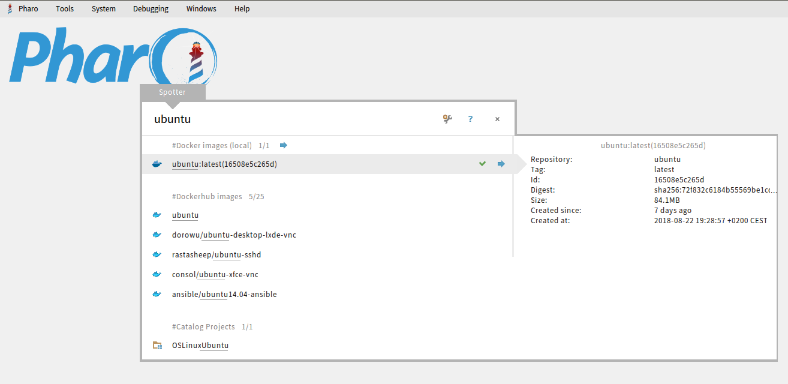

# Pharo-Docker
Access to Docker from Pharo (scripting, Spotter, etc)

# Overview

### Description

With this project it is possible to drive Docker using Pharo language. Additionally it includes tools like
the spotter browser extension to easily work with remote or local docker images directly from a Pharo image.

### Screenshot



## Installation

### Installation of Docker
First install Docker on your local machine. It need to be accessible in the path so Pharo can find the **docker** command.
For Ubuntu use the following steps:

```
sudo apt-get install docker.io
```

As we want to run the docker command without being sudo we need to add our current user to the docker group. This can be easily done using the following two lines:

```
sudo groupadd docker
sudo usermod -a -G docker $USER
```
Typically you have to logout and relogin (or restart your machine) for this to be in effect.

Try your first docker command to see it is working:

```
docker run hello-world

```
### Installation of Pharo

It is easy to download and run Pharo on your machine with the help of [Pharo ZeroConf](http://get.pharo.org/).
Just run the following commands in a shell to download a full Pharo 7 - 64 Bit image together with the virtual machine:

```
wget -O- get.pharo.org/64/70+vm | bash
```

and run it

```
./pharo-ui Pharo.image ../load.st
```

For all those new to Pharo: Pharo also has the concept of an *"image"* - which is a snapshot of the Pharo object memory and not the same as a "Docker image". The Pharo image is a portable file with an *.image extension usable on different operating systems like Linux, Mac, Windows, Raspbian/Pi or other.

### Installation of this project

To install this project into Pharo evaluate the following expression in a Pharo playground. For this go to the Pharo world menu and select *Tools* -> *Playground* to open a playground workspace window. Paste the following expression there:

```Smalltalk
 Metacello new
        baseline:'Docker';
        repository: 'github://astares/Pharo-Docker:master/src';
        load
```

and select *Do it* from the context menu of the playground to evaluate the loading expression.

## Usage

### Retrieve informations

There are three important classes you will find in this package:

 - Docker
 - DockerImage (a local image)
 - DockerHubImage (a remote image)

The first one can be used to get some informations:

```Smalltalk
Docker version
```

You can ask for all *local* docker images:

```Smalltalk
Docker localImages 
```
which should return a collection with at least the already used "hello-world" image. Note that these are images that were already downloaded ("pulled").

You can also do a query to find all *remote* image on [DockerHub](http://hub.docker.com) starting with a specific name:

```Smalltalk
Docker searchDockerHubFor: 'ubuntu' 
```
also returning a collection.

### Pull from DockerHub

Using the project one can also access *remote* images found on DockerHub:

```Smalltalk
DockerHubImage fromHubName: 'pharo/vm'
```

and pull them locally

```Smalltalk
(DockerHubImage fromHubName: 'pharo/vm') pull
```
they will be added locally which you can check again using:

```Smalltalk
Docker localImages 
```

There is an easier expression to pull and directly return the result:

```Smalltalk
Docker pull: 'pharo/image'
```
 
### Remove an image

```Smalltalk
Docker remove: 'pharo/image'
```

... to be continued
